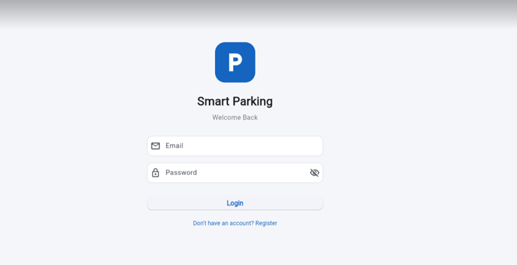
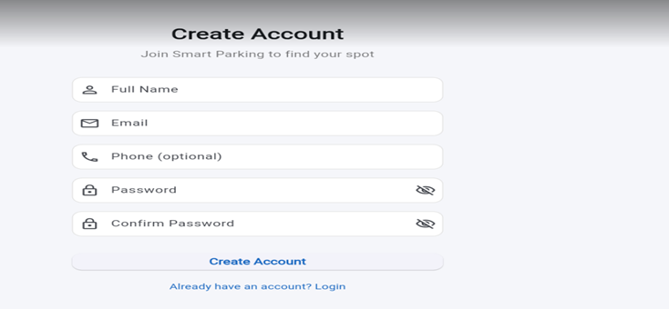
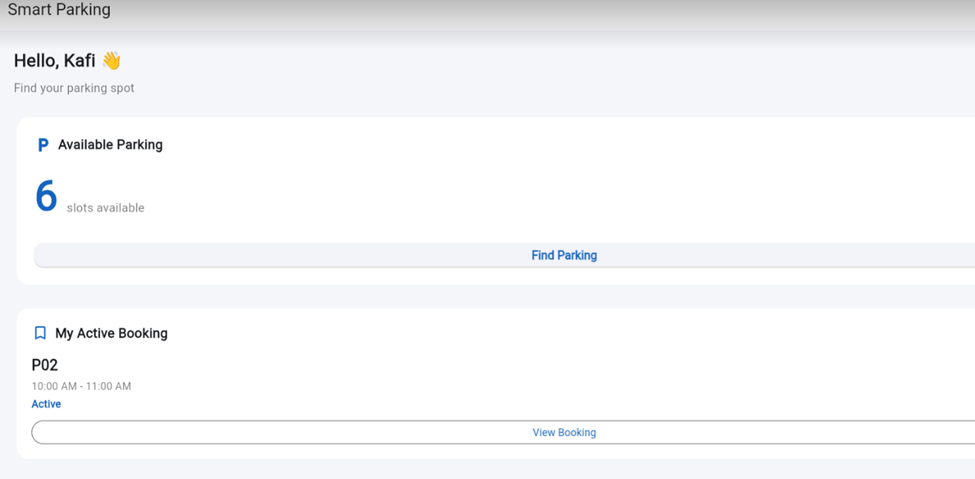
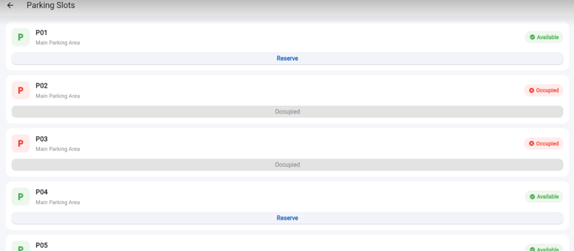
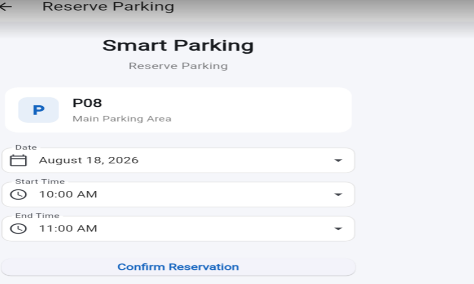
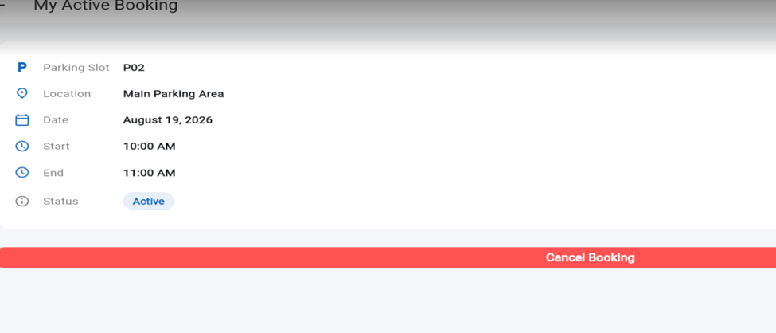
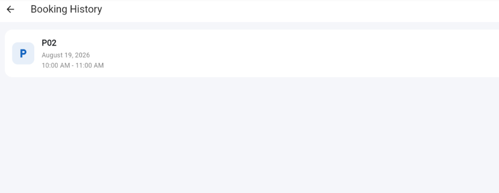

# 🚗 Smart Parking System

A simple **Smart Parking System** mobile application developed using **Flutter** and **Supabase**.

The system allows users to register, log in, view available parking slots, reserve a parking slot, cancel reservations, view booking history, and manage their profiles.

This project was developed as a **group software engineering laboratory project** using the **Agile Extreme Programming (XP)** methodology and **Git/GitHub** for collaborative software development.

---

## 📌 Table of Contents

* [Project Overview](#-project-overview)
* [Objectives](#-objectives)
* [Features](#-features)
* [Technology Stack](#-technology-stack)
* [System Workflow](#-system-workflow)
* [Application Screens](#-application-screens)
* [Project Structure](#-project-structure)
* [Database Design](#-database-design)
* [Supabase Setup](#-supabase-setup)
* [Flutter Setup](#-flutter-setup)
* [Running the Project](#-running-the-project)
* [Git Branch Strategy](#-git-branch-strategy)
* [Team Responsibilities](#-team-responsibilities)
* [Agile XP Practices](#-agile-xp-practices)
* [Git Workflow](#-git-workflow)
* [Example Git Commands](#-example-git-commands)
* [Testing](#-testing)
* [Project Scope](#-project-scope)
* [Future Improvements](#-future-improvements)
* [Limitations](#-limitations)
* [Contributors](#-contributors)
* [License](#-license)

---

# 📖 Project Overview

Finding an available parking space can be time-consuming, especially in busy areas. Drivers may have to search through multiple parking spaces before finding an empty one.

The **Smart Parking System** provides a simple digital solution where users can check parking slot availability and reserve an available slot through a Flutter mobile application.

The application uses **Supabase** for authentication and database management.

The main purpose of this project is to demonstrate:

* Mobile application development with Flutter
* Backend integration using Supabase
* Database operations
* User authentication
* Git and GitHub collaboration
* Branch-based development
* Agile Extreme Programming practices

---

# 🎯 Objectives

The main objectives of the project are:

1. Develop a simple and user-friendly parking application.
2. Allow users to create and manage accounts.
3. Display available and occupied parking slots.
4. Allow users to reserve parking slots.
5. Allow users to cancel their reservations.
6. Maintain booking history.
7. Provide a simple user profile system.
8. Practice collaborative software development using Git and GitHub.
9. Apply Agile Extreme Programming principles.
10. Demonstrate branching, commits, pushes, pull requests, and merging.

---

# ✨ Features

## 🔐 User Authentication

Users can:

* Register a new account
* Log in using email and password
* Log out
* Maintain their profile

Authentication is handled using **Supabase Authentication**.

---

## 🅿️ Parking Slot Management

Users can:

* View all parking slots
* See whether a slot is available or occupied
* Select an available slot
* Reserve a parking slot

Example:

```text
P01    Available    [Reserve]

P02    Available    [Reserve]

P03    Occupied

P04    Available    [Reserve]
```

---

## 📅 Parking Reservation

Users can select:

* Parking slot
* Date
* Start time

After confirmation, the system creates a booking in the Supabase database.

---

## ❌ Cancel Reservation

Users can cancel their active reservation.

After cancellation:

```text
Booking → Cancelled
Parking Slot → Available
```

---

## 📜 Booking History

Users can view their previous reservations.

Each booking displays:

* Parking slot
* Date
* Time
* Booking status

Possible statuses:

* Active
* Cancelled
* Completed

---

## 👤 User Profile

Users can:

* View their name
* View their email
* View their phone number
* Edit their name
* Edit their phone number
* Log out

---

# 🛠 Technology Stack

| Technology               | Purpose                             |
| ------------------------ | ----------------------------------- |
| Flutter                  | Mobile application development      |
| Dart                     | Programming language                |
| Supabase                 | Backend platform                    |
| Supabase Auth            | User authentication                 |
| PostgreSQL               | Database                            |
| Git                      | Version control                     |
| GitHub                   | Remote repository and collaboration |
| Android Studio / VS Code | Development environment             |

---

# 🔄 System Workflow

The basic application workflow is:

```text
                    ┌──────────────┐
                    │ Splash Screen│
                    └──────┬───────┘
                           │
                    Check Authentication
                           │
             ┌─────────────┴─────────────┐
             │                           │
        Not Logged In               Logged In
             │                           │
             ▼                           ▼
         Login Page                  Home Page
             │                           │
             ▼                           │
        Register Page                    │
                                         │
              ┌──────────────────────────┼────────────────────┐
              │                          │                    │
              ▼                          ▼                    ▼
       Parking Slots              Booking History         Profile
              │
              ▼
      Select Available Slot
              │
              ▼
       Select Date & Time
              │
              ▼
      Confirm Reservation
              │
              ▼
         My Booking
              │
              ▼
       Cancel if Needed
```

---

# 📱 Application Screens

The application contains the following main screens:

### 1. Splash Screen

Displays the application logo and name while checking the user's authentication status.

---

### 2. Login Screen

Users enter:

* Email
* Password

Actions:

* Login
* Navigate to Register

---

### 3. Registration Screen

Users enter:

* Full Name
* Email
* Phone
* Password
* Confirm Password

After successful registration, a profile is created in Supabase.

---

### 4. Home Screen

The dashboard displays:

* Welcome message
* Number of available slots
* Current booking
* Quick actions

Example:

```text
Hello, User 👋

Find your parking spot

┌─────────────────────┐
│ Available Slots     │
│         7           │
└─────────────────────┘

┌─────────────────────┐
│ My Active Booking   │
│        P04          │
└─────────────────────┘

[ Find Parking ]
```

---

### 5. Parking Slots Screen

Displays parking slots in a grid/list.

Available slots have an enabled **Reserve** button.

Occupied slots cannot be reserved.

---

### 6. Booking Screen

Allows the user to select:

* Date
* Start time

and confirm the reservation.

---

### 7. My Booking Screen

Displays the user's current active booking.

The user can cancel the booking.

---

### 8. Booking History Screen

Displays previous bookings.

---

### 9. Profile Screen

Displays user information and provides:

* Edit Profile
* Logout

---

# 📂 Project Structure

The project follows a simple and organized Flutter structure.

```text
smart_parking_system/
│
├── android/
├── ios/
├── web/
├── test/
│
├── lib/
│   │
│   ├── main.dart
│   ├── app.dart
│   │
│   ├── models/
│   │   ├── parking_slot.dart
│   │   ├── booking.dart
│   │   └── user_profile.dart
│   │
│   ├── services/
│   │   ├── supabase_service.dart
│   │   ├── auth_service.dart
│   │   ├── parking_service.dart
│   │   └── booking_service.dart
│   │
│   ├── pages/
│   │   ├── splash_page.dart
│   │   ├── login_page.dart
│   │   ├── register_page.dart
│   │   ├── home_page.dart
│   │   ├── parking_slots_page.dart
│   │   ├── booking_page.dart
│   │   ├── booking_history_page.dart
│   │   ├── profile_page.dart
│   │   └── edit_profile_page.dart
│   │
│   ├── widgets/
│   │   ├── parking_slot_card.dart
│   │   ├── booking_card.dart
│   │   └── custom_button.dart
│   │
│   └── theme/
│       └── app_theme.dart
│
├── pubspec.yaml
├── README.md
└── .gitignore
```

---

# 🗄️ Database Design

The project uses **Supabase PostgreSQL**.

The database contains three main tables:

```text
profiles
    │
    │ 1
    │
    │
    │ *
bookings
    │
    │ *
    │
    │ 1
    │
parking_slots
```

---

## 👤 Profiles Table

```text
profiles
--------------------------------
id          UUID
name        TEXT
email       TEXT
phone       TEXT
created_at  TIMESTAMP
```

The `id` corresponds to the authenticated Supabase user's ID.

---

## 🅿️ Parking Slots Table

```text
parking_slots
--------------------------------
id           BIGINT
slot_number  TEXT
location     TEXT
status       TEXT
created_at   TIMESTAMP
```

Example:

| Slot | Location     | Status    |
| ---- | ------------ | --------- |
| P01  | Main Parking | available |
| P02  | Main Parking | available |
| P03  | Main Parking | occupied  |
| P04  | Main Parking | available |
| P05  | Main Parking | occupied  |

---

## 📅 Bookings Table

```text
bookings
--------------------------------
id              BIGINT
user_id         UUID
parking_slot_id BIGINT
booking_date    DATE
start_time      TIMESTAMP
end_time        TIMESTAMP
status          TEXT
created_at      TIMESTAMP
```

Possible booking statuses:

```text
active
cancelled
completed
```

---

# ☁️ Supabase Setup

## 1. Create a Supabase Project

Create a new project on Supabase.

After creating the project, obtain:

* Project URL
* Publishable/anon key

Do not commit private service-role keys to GitHub.

---

## 2. Enable Authentication

Open:

```text
Supabase Dashboard
        ↓
Authentication
        ↓
Providers
        ↓
Email
```

Enable email/password authentication.

---

# 🗃️ Create Database Tables

Open:

```text
Supabase Dashboard
        ↓
SQL Editor
```

Run the database schema provided with the project.

The schema should create:

```text
profiles
parking_slots
bookings
```

and their relationships.

---

# 🔐 Row Level Security

Row Level Security should be enabled for the user-related tables.

Users should only be able to access their own:

* Profile
* Bookings

Authenticated users can read parking slot information.

The database policies should prevent one user from modifying another user's bookings.

---

# 📦 Flutter Dependencies

The main package required for Supabase integration is:

```yaml
dependencies:
  flutter:
    sdk: flutter

  supabase_flutter:
```

Other dependencies may be added if required by the implementation.

After cloning the project:

```bash
flutter pub get
```

---

# ⚙️ Configuration

Supabase credentials should be configured using environment/configuration variables.

Do not commit private credentials.

Example:

```text
SUPABASE_URL=your-project-url
SUPABASE_KEY=your-publishable-key
```

The actual project configuration should follow the method used by the implementation.

### Important

Never upload the following to GitHub:

```text
service_role_key
private API keys
database passwords
```

Only the public/publishable Supabase client key should be used in the Flutter application.

---

# 🚀 Running the Project

## 1. Clone Repository

```bash
git clone <repository-url>
```

Navigate to the project:

```bash
cd smart_parking_system
```

---

## 2. Install Dependencies

```bash
flutter pub get
```

---

## 3. Configure Supabase

Add the required Supabase project URL and publishable key according to the project's configuration.

---

## 4. Check Flutter Environment

```bash
flutter doctor
```

---

## 5. Run the Application

Connect an Android device or start an emulator.

Then:

```bash
flutter run
```

---

# 🌿 Git Branch Strategy

This project is developed by **three team members**.

The repository uses:

```text
main
│
├── auth
├── parking
└── history
```

The `main` branch contains the integrated final version.

Each member works on their own feature branch.

---

# 👥 Team Responsibilities

## Member 1 — Authentication

Branch:

```bash
auth
```

Responsibilities:

* Splash screen
* Login
* Registration
* Supabase authentication
* Profile
* Logout

Example commits:

```bash
git commit -m "Create login page"
git commit -m "Implement user registration"
git commit -m "Add Supabase authentication"
git commit -m "Implement profile page"
```

---

## Member 2 — Parking & Reservation

Branch:

```bash
parking
```

Responsibilities:

* Home page
* Parking slot display
* Parking slot cards
* Available/occupied status
* Reservation
* Booking creation

Example commits:

```bash
git commit -m "Create parking slots page"
git commit -m "Add parking slot model"
git commit -m "Implement parking service"
git commit -m "Add parking reservation"
```

---

## Member 3 — Booking History

Branch:

```bash
history
```

Responsibilities:

* My Booking page
* Cancel booking
* Booking history
* Bottom navigation
* Related UI improvements

Example commits:

```bash
git commit -m "Create booking history page"
git commit -m "Implement current booking"
git commit -m "Add booking cancellation"
git commit -m "Add bottom navigation"
```

---

# 🔀 Git Workflow

Each member follows:

```text
Clone Repository
      ↓
Create / Checkout Branch
      ↓
Make Changes
      ↓
Test
      ↓
git add
      ↓
git commit
      ↓
git push
      ↓
Create Pull Request
      ↓
Code Review
      ↓
Merge into main
```

---

# 💻 Basic Git Commands

## Clone Repository

```bash
git clone <repository-url>
cd smart_parking_system
```

---

## Check Branches

```bash
git branch
```

---

## Create Branch

```bash
git checkout -b auth
```

or:

```bash
git switch -c auth
```

---

## Check Status

```bash
git status
```

---

## Add Changes

```bash
git add .
```

---

## Commit Changes

```bash
git commit -m "Implement login page"
```

---

## Push Branch

```bash
git push -u origin auth
```

For another branch:

```bash
git push -u origin parking
```

```bash
git push -u origin history
```

---

# 🔄 Updating Local Main

Before starting new work:

```bash
git checkout main
git pull origin main
```

Then switch back to your branch:

```bash
git checkout auth
```

and update it if necessary.

---

# 🔀 Pull Requests

After completing a feature:

1. Push the branch to GitHub.
2. Open the GitHub repository.
3. Create a Pull Request.
4. Select:

```text
base: main
compare: auth
```

5. Add a meaningful PR title.
6. Describe the changes.
7. Review the code.
8. Merge after approval.

The same process is followed for:

```text
parking → main
history → main
```

---

# 🧪 Testing

The application should be tested manually and, where appropriate, with Flutter tests.

Basic test scenarios include:

| Test                         | Expected Result             |
| ---------------------------- | --------------------------- |
| Register with valid data     | Account created             |
| Register with invalid email  | Error displayed             |
| Login with valid credentials | User enters Home            |
| Login with wrong password    | Error displayed             |
| View parking slots           | Slots displayed             |
| Reserve available slot       | Booking created             |
| Reserve occupied slot        | Reservation prevented       |
| Create second active booking | Reservation prevented       |
| Cancel booking               | Booking cancelled           |
| Cancel booking               | Slot becomes available      |
| View history                 | Previous bookings displayed |
| Edit profile                 | Profile updated             |
| Logout                       | User returned to Login      |

---

# 🔒 Security

The project follows basic security practices.

* Supabase Authentication handles passwords.
* Users access only their own profile data.
* Users access only their own bookings.
* Row Level Security is enabled.
* Private Supabase service-role keys are never stored in the Flutter application.
* Sensitive credentials are excluded from Git.

---

# 📋 Project Scope

## Included

* User registration
* User login/logout
* Profile management
* Parking slot viewing
* Parking slot availability
* Parking reservation
* Reservation cancellation
* Current booking
* Booking history
* Supabase database
* Git/GitHub collaboration

## Not Included

* Online payment
* GPS navigation
* Google Maps
* Parking sensors
* IoT devices
* License plate recognition
* AI/ML
* Push notifications
* Admin dashboard
* Hardware integration

The project intentionally keeps the functionality limited because it is designed as a **university laboratory project**.

---

# 🚧 Limitations

The current version has several limitations:

1. Parking slot availability is managed through the database rather than physical sensors.
2. No online payment system is implemented.
3. No GPS navigation is implemented.
4. The application does not automatically detect vehicle arrival.
5. Only basic reservation functionality is provided.
6. The system is intended for demonstration purposes rather than commercial deployment.

---

# 🔮 Future Improvements

Future versions could include:

* Online payment
* Google Maps integration
* GPS-based parking search
* QR-code-based parking entry
* Parking sensors
* Automatic slot detection
* Push notifications
* Reservation reminders
* Multiple parking locations
* Admin dashboard
* Parking analytics
* Vehicle/license plate recognition

These features are intentionally excluded from the current version.

---

# 🧑‍💻 Agile Extreme Programming (XP)

The project follows basic **Extreme Programming (XP)** practices.

### Small Releases

Features are developed and integrated in small increments.

### Simple Design

The application avoids unnecessary complexity and implements only the required functionality.

### Continuous Integration

Team members frequently push and merge their work into the main branch.

### Testing

Features are tested before being merged.

### Customer/User Feedback

Requirements can be adjusted based on feedback during development.

### Pair/Team Collaboration

Team members review each other's code through GitHub Pull Requests.

---

# 📊 Development Phases

## Phase 1 — Requirement Analysis

Completed:

* Project overview
* Problem statement
* Stakeholder identification
* Scope
* Functional requirements
* Non-functional requirements
* User stories
* Assumptions
* Constraints

---

## Phase 2 — Project Setup

Tasks:

* Create Flutter project
* Create GitHub repository
* Configure Supabase
* Create database
* Create branches
* Assign responsibilities

---

## Phase 3 — Feature Development

### Member 1

Authentication and profile.

### Member 2

Parking slots and reservations.

### Member 3

Booking history and cancellation.

---

## Phase 4 — Integration

Merge feature branches:

```text
auth
   ↓
main

parking
   ↓
main

history
   ↓
main
```

Resolve conflicts and test the integrated application.

---

## Phase 5 — Testing

Test:

* Authentication
* Parking availability
* Reservation
* Cancellation
* Booking history
* Profile
* Navigation

---

# 📁 Repository Structure

The GitHub repository should approximately contain:

```text
smart-parking-system/
│
├── android/
├── ios/
├── lib/
├── test/
│
├── README.md
├── pubspec.yaml
├── .gitignore
└── ...
```

---

# 📸 Screenshots

Add screenshots of the completed application here.

Example:


## Login Page
<p align="center">

</p>

## Signup Page
<p align="center">

</p>

## Dashboard
<p align="center">

</p>

## Available Slots
<p align="center">

</p>

## Reservation Page
<p align="center">

</p>

## Reservation Details page
<p align="center">

</p>

## Booking History page
<p align="center">

</p>


---

# 🎥 Project Demonstration

The final demonstration should show:

1. User registration
2. Login
3. Home screen
4. Available parking slots
5. Parking reservation
6. Current booking
7. Cancellation
8. Booking history
9. Profile editing
10. Logout
11. GitHub branches
12. GitHub commits
13. Pull Requests
14. Merged `main` branch

---

# 👨‍👩‍👦 Team

| Member   | Branch    | Responsibility                 |
| -------- | --------- | ------------------------------ |
| Kafi(14) | `auth`    | Authentication & Profile       |
| Tajbid(15) | `parking` | Parking & Reservation          |
| Zahid(13) | `Booking` | Booking History & Cancellation |


---

# 📜 License

This project was developed for **academic and educational purposes** as part of a university software engineering laboratory.

It is not intended for commercial deployment.

---

# ⭐ Acknowledgement

This project was developed as a collaborative learning project to practice:

* Flutter development
* Supabase integration
* Database management
* Software requirement analysis
* Agile Extreme Programming
* Git version control
* GitHub collaboration
* Branching and merging
* Pull Requests
* Software testing

---

## 🚗 Smart Parking System

**Find a spot. Reserve a spot. Park with ease.**
